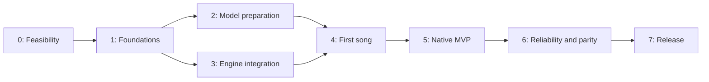

# Phased implementation plan

Status: **Phase 0 in progress**; phases 1–7 are not started.
Last updated: 2026-09-26.

[FEATURES.md](FEATURES.md) is the source of truth for product behavior.
[DATA-FORMATS.md](DATA-FORMATS.md) defines persisted data; this plan sequences
implementation and validation without changing either contract. The research
and Bunyi references are recorded in [REFERENCES.md](REFERENCES.md).

Phase 0 research tools and evidence are recorded in the
[feasibility report](../docs/validation/phase0/README.md) and
[engine decision record](../docs/decisions/0001-engine-feasibility.md).
No production native application or release acceptance gate has passed.

## Delivery constraints

- Windows: WinForms. Linux: GTK 4/Gir.Core. macOS: Swift with SwiftUI/AppKit.
- Install the app with all application runtimes and redistributable engine
  dependencies. No terminals, dependency installers, or separately run server.
- Standard installers contain no model weights or vendor GPU runtime packs.
  Generate downloads only missing required model assets and, where the backend
  needs one, the pinned vendor GPU runtime pack, verifies them, and continues
  automatically.
- Installed models work offline; downloading never uploads song inputs or audio.
- The app supervises a private generation process. Use pipes; no localhost HTTP
  listener or user-configurable service is part of the application.
- Keep the three platforms at feature parity through the shared spec, shared
  fixtures, and recorded acceptance evidence.
- Retain the MVP scope in FEATURES.md. Covers, transcription, stems, score editing,
  conversational editing, batches, arbitrary model sources, and hosted inference
  are not added by this plan.

## Phase overview and dependencies

| Phase | Outcome | Depends on | Status |
| --- | --- | --- | --- |
| 0. Prove engine and model feasibility | A measured local inference and redistribution path for every target | None | In progress |
| 1. Establish application foundations | Native shells, contracts, fixtures, and build pipelines | 0 | Not started |
| 2. Implement model preparation | Reliable on-demand download, verification, resume, and offline cache | 1 | Not started |
| 3. Integrate the generation engine | App-managed worker and cancellable generation orchestration | 1 | Not started |
| 4. Deliver the first-song flow | An installable end-to-end alpha on all three platforms | 2 and 3 | Not started |
| 5. Complete the native MVP | Projects, playback, model settings, local help, and accessible interfaces | 4 | Not started |
| 6. Prove reliability and parity | Evidence for every shared acceptance scenario | 5 | Not started |
| 7. Package and qualify the release | Final installers tested on clean supported machines | 6 | Not started |



Phases 2 and 3 can proceed independently once their contracts are fixed. Use a
mock worker to develop preparation/UI behavior and pre-staged verified models to
develop inference. Neither substitute satisfies the real-engine gates in phase 4.
Contract or fixture changes must be coordinated across both implementations.

## Architecture and proposed repository layout

Windows and Linux share UI-independent C# services for preparation, projects,
settings, progress, and worker communication. Their native controls remain in
separate application projects. macOS implements equivalent services in Swift and
uses the same protocol, catalog semantics, and portable project fixtures.

The engine receives only verified local model paths and a frozen request. The
application owns all network preparation. Engine logs use a separate channel
from structured messages; audio is passed through files rather than JSON payloads.

The following is a planned layout, not a list of files already implemented:

```text
apps/
  dotnet/
    src/Lagu.Core/                 # UI-independent application services
    src/Lagu.Windows/              # WinForms controls and Windows integration
    src/Lagu.Linux/                # GTK 4/Gir.Core controls and Linux integration
    tests/                        # core contracts and platform adapter checks
  macos/
    Sources/LaguCore/              # Swift services and contract implementation
    Sources/LaguApp/               # SwiftUI/AppKit and macOS integration
    Tests/
engine/
  worker/                         # private pipe adapter around selected engine
  backends/                       # pinned integration/patches; platform variants if needed
  tests/
spec/
  schemas/                        # future versioned schemas, derived from the spec
  fixtures/                       # future shared request/project/progress fixtures
resources/
  models/                         # pinned catalog and notices, never model weights
packaging/
  windows/
  linux/
  macos/
tools/
  validation/                     # deterministic download and worker test tools
docs/
  decisions/                      # recorded engine, compatibility, and package decisions
  validation/                     # reports referencing immutable builds/model versions
.github/workflows/                # native builds and contract checks
```

Do not adopt Bunyi's Avalonia UI, TTS model catalog, hosting settings, or credentials.
If implementation code is later reused, preserve its license and attribution.

## Phase 0 — Prove engine and model feasibility

**Goal:** determine whether every target can generate a complete song locally and
ship all necessary runtime components in the app.

Work:

- [ ] P0-01 Record candidate OS/architecture/GPU targets: Windows and Linux with
  NVIDIA initially, macOS on Apple Silicon. Obtain access to real test hardware;
  an unavailable target remains unverified, not implicitly supported.
- [ ] P0-02 Freeze source and dependency revisions for a YuE2 reference run and
  the community `yue2.cpp` candidate. Record the generator, decoder, quantization,
  tokenizer/config assets, license notices, and checksums for each profile.
- [ ] P0-03 Generate short and full-song samples on every target. Compare the
  candidate against official inference using fixed requests, intermediate-stage
  checks where supported, and recorded listening comparisons. Do not require
  bit-identical audio from different engines or quantizations.
- [ ] P0-04 Measure cold/warm startup, generation duration, peak RAM/VRAM, cache
  size, temporary/output space, repeated-job memory behavior, and failure modes.
  Agree on acceptable quality and latency targets from these results.
- [ ] P0-05 Try the C++ Metal path on Mac first. If unsuitable, evaluate a bundled
  MLX adapter, then a fully bundled Python runtime if needed. Validate the reported
  MPS attention issue before adopting that Python path. Record one selected
  backend per target rather than retaining untested alternatives as promises.
- [ ] P0-06 Inventory redistributable runtime/native libraries and model terms;
  record an open-source application-license choice and separate model notices.
  Confirm an approved immutable download origin. A Lagu mirror is not assumed.
- [ ] P0-07 Select provisional .NET, Gir.Core, GTK, Swift, OS, and packaging
  baselines that can satisfy clean-machine installation. Separate working OS GPU
  drivers from app-bundled libraries; do not rely on a developer toolkit's PATH.

Deliverables: engine decision record, benchmark/quality report, dependency and
license inventory, provisional support matrix, and frozen candidate model profiles.

Progress, 2026-09-26: source/model candidates and a Windows reference dependency
environment are pinned; fixed requests and a local benchmark runner are present.
Windows eager-reference short/repeated/full runs passed technical checks; the
default backend's flash-attention failure is recorded. The pinned C++ Q8 CUDA
candidate built and passed the same Windows technical checks, with acoustic-stage
parity recorded. A first blind listening review preferred the C++ takes; broader
listening remains open. WSL is an auxiliary Linux
environment, not native Linux qualification. The user confirmed no Mac is
currently available. All P0 checkboxes stay open until their full cross-platform
deliverables are satisfied; see the [evidence ledger](../docs/validation/phase0/README.md).

**Exit gate:** each target has a complete local generation and a credible bundled
runtime path, with measured limits recorded. This supplies preliminary AC-016
evidence, not a completed UI acceptance result. If a target fails, resolve its
backend here; do not quietly replace native/local generation with a server or
shrink the three-platform scope. A scope change belongs in FEATURES.md first.

## Phase 1 — Establish application foundations

**Goal:** create buildable native shells and shared contracts before feature code
diverges across languages.

Work:

- [ ] P1-01 Scaffold WinForms, GTK 4/Gir.Core, and SwiftUI/AppKit applications plus
  UI-independent C# and Swift service modules. Add versioned dependency locks and
  native build jobs. GPU tests run only on explicitly available hardware.
- [ ] P1-02 Convert DATA-FORMATS.md into versioned schemas and shared fixtures for
  catalog/profile identity, cache receipts, draft/project records, and results.
  Resolve any schema ambiguity in that document before writing serializers.
- [ ] P1-03 Specify the private worker protocol: handshake/version negotiation,
  capabilities, generate, cancel, shutdown, progress, errors, and terminal results.
  Include job IDs, message-size/framing limits, and exactly one terminal outcome.
  Use UTF-8 JSON messages over pipes; reserve stderr for diagnostics.
- [ ] P1-04 Define the application state machine and cancellation rules from
  GEN-003 through GEN-010. Persist a submitted draft before lengthy preparation.
  Design interfaces for model preparation, process supervision, storage, clocks,
  filesystem operations, and native playback without importing a UI toolkit.
- [ ] P1-05 Add a deterministic mock worker, controlled download test origin, and
  cross-language fixtures. These are developer test tools, never a production
  server that users must run.
- [ ] P1-06 Prove skeleton packaging can launch each native shell on a clean target
  without separately installed .NET, GTK, Python, or other app dependencies.

Deliverables: native shells, build workflows, protocol specification, data schemas,
fixtures, service boundaries, and skeleton packages containing no model weights.

**Exit gate:** all three shells build and open; C# and Swift agree on valid/invalid
fixtures and state transitions; the mock worker starts and stops through pipes.
Record early AC-001 evidence. Native libraries missing from a clean machine must
be addressed before proceeding to the full first-song flow.

## Phase 2 — Implement model preparation

**Goal:** make first-use downloading reliable and observable, following Bunyi's
behavior with Lagu's pinned integrity requirements.

Work:

- [ ] P2-01 Implement catalog resolution, compatible default profile selection,
  required asset sets, immutable source identity, and local-readiness checks.
  Resolve a ready cache without any network request.
- [ ] P2-02 Implement cache paths, process locks, partial records, full-file SHA-256
  verification, completed-file promotion, and atomic ready receipts. Keep older
  verified revisions usable while preparing a newer one.
- [ ] P2-03 Implement incremental reuse and byte-range resume. Cover ignored
  ranges, invalid offsets, 416 responses, redirects, expiring signed URLs, and
  changed identities. Invalid paths must never escape the cache.
- [ ] P2-04 Implement bounded rate-limit waits, service error classification,
  cancellation, and user-initiated reconnect. Preserve useful bytes; Stop must
  win over a reconnect or retry that finishes concurrently.
- [ ] P2-05 Implement progress observations and a shared set of expected traces:
  unique retained bytes, live receipts, overall/current-file totals, unknown
  totals, recent speed, elapsed time, download ETA, and slow/stalled states.
- [ ] P2-06 Implement preflight checks and Download, Verify, Remove, and local-pack
  import services. Source-selection and storage semantics must agree in C# and
  Swift. No UI polish is required yet, but errors must retain structured context.
- [ ] P2-07 Implement GPU runtime pack preparation (MOD-015): pinned vendor archive
  download and resume, archive verification, allow-listed extraction with per-file
  digests, a separate runtime cache, offline import of the pinned archive, and a
  pre-launch full-hash check. Cover AC-017 at the service level.

Deliverables: C# and Swift preparation services, curated test catalog, deterministic
transfer tests, cache/import fixtures, and progress observation traces.

**Exit gate:** service-level cases for AC-003 through AC-011, AC-014, and AC-017
pass in both implementations. Verify offline cache use with network requests prohibited, not
merely with a fast cached response. Stop/resume a real large model file once on
each implementation as a bounded integration check. Native UI evidence follows
in phase 4; service tests alone do not complete those acceptance scenarios.

## Phase 3 — Integrate the generation engine

**Goal:** make the selected engine a cancellable internal component of the app.

Work:

- [ ] P3-01 Implement the pipe adapter around the selected engine. The existing
  community CLI/HTTP interface is not assumed to implement this contract. Keep
  engine patches minimal, pinned, and documented.
- [ ] P3-02 Pass verified local asset paths and the frozen request to the worker.
  Disable implicit model downloads, dependency installation, and remote code
  loading. Reject unsupported profile/engine combinations before model load, and
  confirm every required model file is present before launch: Phase 0 found that
  yue2.cpp only opens the decoder after generation.
- [ ] P3-03 Implement process supervision in C# and Swift: hidden launch, handshake,
  separate diagnostics, crash detection, shutdown, and cleanup on parent exit.
  Select and test OS-specific lifetime controls for child processes. Load GPU
  runtime libraries only by full path from the verified runtime cache; prove a
  same-named library in PATH, the app folder, or the working directory is ignored.
- [ ] P3-04 Keep the control channel responsive during inference. Wire cooperative
  cancellation through every supported stage, then bounded process termination
  if the engine cannot stop. Choose the grace period from measurements and keep
  the UI in Stopping until resource cleanup completes.
- [ ] P3-05 Normalize stage events and errors without fabricating progress. Distinguish
  an engine error, out-of-memory failure, user cancellation, and truncated output.
  Discard stale events by job ID and release model resources after a job.
  Stage outputs under temporary names and promote them only after a clean exit
  and an explicit success message; then apply the GEN-010 audio checks, because
  corrupt weights can yield a successful exit with silent audio.
- [ ] P3-06 Implement the application coordinator: validate -> snapshot -> preflight
  -> prepare models -> load -> generate -> finalize take. Save audio and metadata
  before reporting success; interrupted writes remain identifiable and recoverable.

Deliverables: bundled worker builds, process adapters, generation coordinator,
engine integration tests, and recorded real generation/cancellation runs.

**Exit gate:** real local generation succeeds on each target through the app
services. Kill/cancel at load, planning, synthesis, and save boundaries; no later
success event or orphan worker may survive. Validate the relevant service-level
portions of AC-011, AC-012, and AC-016. No user-managed or localhost server is needed.

## Phase 4 — Deliver the first-song flow

**Goal:** ship an internal alpha demonstrating the complete non-technical workflow
on all three platforms before expanding the interface.

Work:

- [ ] P4-01 Connect the native shells to the real coordinator. Provide lyrics,
  style, the default profile, optional seed, Generate/Stop, and a result playback
  action. Use native controls and keep inference off the UI thread.
- [ ] P4-02 Add the missing-model notice, actual byte progress, checking/loading/
  generation stages, Stop, reconnect, retry, and useful failure messages. Do not
  require confirmation for every file or another Generate after preparation.
- [ ] P4-03 Implement the minimum successful project/take save and WAV playback/
  export path. Freeze generation inputs while retaining access to Help and Logs.
- [ ] P4-04 Produce self-contained internal packages with the engine and runtime
  dependencies but no weights. Validate from an empty per-user cache on clean
  supported machines, without borrowing development-environment dependencies.
- [ ] P4-05 Run first generation online, then another generation with all networking
  blocked. Also test first use offline and Stop/restart during a model download.

Deliverables: Windows, Linux, and macOS alpha packages, one captured end-to-end
run per platform, and a list of measured compatibility/packaging defects.

**Exit gate:** AC-001 through AC-005 pass for the alpha's actual UI on every target.
The normal journey is install -> open -> Generate -> automatic model preparation
-> saved/playable song. Subsequent generation works offline. No terminal,
separate dependency installation, or server instruction appears in user setup.

## Phase 5 — Complete the native MVP

**Goal:** turn the working first-song flow into the complete scoped application.

Work:

- [ ] P5-01 Complete composer validation, local lyric examples, accessible seed/
  profile controls, draft persistence, and restoration after interruption.
- [ ] P5-02 Complete project open/save, a local results list, immutable earlier
  takes, recorded effective model/engine settings, and incomplete-result warnings.
  Moving a project between operating systems must preserve audio playback.
- [ ] P5-03 Complete play/pause/seek, time/duration display, native save dialogs,
  WAV export, and playback while preparation or generation is busy.
- [ ] P5-04 Add model settings with status, local size, version, license, Download,
  Verify, Remove, Open models folder, and local-pack import. Explain preparation
  without exposing engine internals in the basic workflow.
- [ ] P5-05 Add local Help, useful log viewing, stage-specific recovery, and credits.
  Verify that song content and signed download credentials do not leak to network
  requests or routine diagnostic logs.
- [ ] P5-06 Complete keyboard operation, native accessibility labels, paced progress
  announcements, reduced-motion behavior, and supported scaling/minimum sizes.
  Native layout can differ; every required action must remain reachable.
- [ ] P5-07 Exercise normal close, forced termination, and reopening. Preserve drafts,
  partials, completed models, and earlier results; never auto-resume an old song.

Deliverables: feature-complete native UIs, portable project examples, local help,
model management screens, and a requirement-by-platform implementation ledger.

**Exit gate:** every MVP requirement has an implementation on each target and a
linked verification case. AC-013 through AC-015 pass on representative machines;
all other scenarios are ready for full regression in phase 6. Outstanding feature
gaps remain explicit; compiling a shared service does not complete a native UI.

## Phase 6 — Prove reliability and parity

**Goal:** establish that the same promised behavior survives failures on all targets.

Work:

- [ ] P6-01 Run every AC-001 through AC-018 scenario against identified candidate
  builds and model profiles. Record failures against requirement IDs and retest
  affected behavior after fixes.
- [ ] P6-02 Use deterministic transport tests for partial/unknown responses, range
  errors, rate limits, slow/trickle/stalled connections, corrupt same-size files,
  unsafe manifests, full disks, unwritable folders, and cancelled reconnects.
- [ ] P6-03 Exercise simultaneous app instances and download/delete/generation
  races. Kill worker and parent processes during transfer, verification, inference,
  and save; ensure cache and project receipts describe the surviving state.
- [ ] P6-04 Validate real native accessibility with Narrator, Orca, and VoiceOver,
  keyboard-only navigation, scaling, and minimum window sizes. In-process UI tests
  are not evidence of what a screen reader announces.
- [ ] P6-05 Repeat the fixed short/full-song quality suite on the selected hardware.
  Record latency and memory limits without promising bitwise seed equivalence.
  Confirm repeated jobs and playback do not accumulate unreleased engine resources.
- [ ] P6-06 Move shared project fixtures between all three apps; test valid and
  unsupported schema versions, missing model caches, and explicit local imports.

Deliverables: acceptance ledger, failure/recovery report, accessibility results,
updated compatibility measurements, and resolved defect records.

**Exit gate:** all 18 acceptance scenarios have passing evidence on each supported
platform, with scope-specific hardware evidence for real generation. Fix blockers
before release. A new OS or engine exception requires a feature-spec update;
adding a footnote to this plan cannot waive a product requirement.

## Phase 7 — Package and qualify the release

**Goal:** publishable installers that retain the tested non-technical experience.

Work:

- [ ] P7-01 Produce versioned Windows installer, selected Linux package(s), and
  macOS application/DMG with all native runtimes. Complete Windows signing and
  macOS signing/notarization arrangements; include required redistributable notices.
- [ ] P7-02 Verify the final packaged catalog: immutable sources/revisions, expected
  sizes and hashes, complete generator/decoder/config asset sets, and license data.
  There must be no model weights, vendor GPU runtime packs, developer credentials,
  or environment-specific absolute paths in standard application packages.
- [ ] P7-03 Install the exact candidate packages on clean supported systems with
  no development tools or separately installed application runtimes. Verify first
  model download from the real approved origin and a later fully offline song.
- [ ] P7-04 Test upgrade and uninstall from actual packages. Keep models outside
  application installation paths and preserve user projects/exports. Validate
  Unicode/spaced paths and a normal non-administrator account after installation.
- [ ] P7-05 Publish the measured support matrix, local setup/recovery help, release
  notes, checksums, component/model license notices, and source/build instructions.
  Final publication is a distinct release action; this plan does not perform it.
- [ ] P7-06 Attach phase-6 evidence to the exact release candidate and rerun tests
  affected by packaging changes. At minimum repeat AC-001 through AC-005 and
  AC-014 from the final packages; avoid repeatedly running unrelated expensive
  GPU checks unless binaries, profiles, or unresolved failures changed.

Deliverables: qualified release packages, checksums, source and notices, user
documentation, and a per-platform release qualification record.

**Exit gate:** the exact distributable packages meet standalone installation,
first-use download, offline reuse, and data-retention promises. Package creation
or a developer-machine launch alone is not release qualification.

## Requirement ownership and evidence

Ranges below refer to the stable IDs in FEATURES.md. They assign implementation
work; the feature specification remains authoritative if wording changes.

| Requirements | Primary implementation phases | Final evidence |
| --- | --- | --- |
| APP-001 through APP-003 | 1, 3, 4, 7 | AC-001, AC-002, AC-012 on final native packages |
| APP-004 through APP-006 | 2, 3, 4, 7 | AC-001 through AC-004 with network observation |
| APP-007, UX-004, UX-005 | 0, 4, 5, 7 | App/source and dependency/model notices; AC-015 |
| GEN-001 through GEN-005 | 1, 3, 4, 5 | AC-002, AC-004, AC-011 |
| GEN-006 through GEN-010 | 3, 4, 5 | AC-005, AC-012, AC-016 |
| GEN-011 | 3, 4, 5 | AC-018 on a machine without a supported GPU |
| MOD-001 through MOD-010, MOD-013 through MOD-014 | 0, 2, 4 | AC-002 through AC-007, AC-011, AC-014 |
| MOD-011 through MOD-012 | 2, 5 | AC-014, AC-015 |
| DL-001 through DL-009 | 2, 4, 5 | AC-008, AC-009, AC-015 |
| MOD-015 | 0, 2, 3, 4 | AC-002, AC-003, AC-017 on final packages |
| NET-001 through NET-007 | 2, 4 | AC-005 through AC-010; path/source isolation cases |
| OUT-001 through OUT-005 | 3, 4, 5, 7 | AC-012 through AC-014, AC-016 |
| UX-001 through UX-003 | 4, 5 | AC-011, AC-012, AC-015 |

Each phase closes with a record of build/commit ID, platform and driver versions,
engine/model revisions, tests actually run, observed result, and remaining gaps.
Use Passed, Failed, or Not run; do not count an unavailable machine as a pass.
Phase-0 measurements determine a realistic schedule and minimum hardware rather
than using unverified download sizes, memory figures, or calendar estimates.

## Remaining decisions and deadlines

| Decision | Resolve by | Basis |
| --- | --- | --- |
| Engine/backend and redistributable dependency set | End of phase 0 | Complete measured generation and bundled-runtime feasibility on each target. |
| Vendor GPU runtime pack terms and pins | End of phase 0 | Terms: decided 2026-09-26 by the project owner's reading (no download gate observed); show the archive's NVIDIA license. Windows pins verified; Linux pins still needed. |
| Model mirror and conversion | End of phase 0 | Decided 2026-09-27: host the project's own conversion of the official weights on the Cloudflare R2 mirror, with Hugging Face as the explicit alternate. Still to do: produce and verify the conversion, choose the mirror domain, and pin both sources. |
| Approved model distribution terms | End of phase 0 | Apache-2.0 source license selected and applied; exact selected components/weights still need distribution review. |
| Candidate OS/architecture/GPU profiles and GTK baseline | End of phase 0; confirm in 6 | Actual compatibility, memory, quality, and latency evidence. |
| Model revisions, origin, full asset set, hashes | End of phase 0; verify in 7 | Immutable files and approved distribution; no invented Lagu mirror. |
| Pipe protocol and concrete data schemas | End of phase 1 | Cross-language fixtures, responsive cancellation, and version negotiation. |
| Linux package format and native library strategy | End of phase 1; confirm in 7 | Successful clean-machine skeleton install and final GPU qualification. |
| Release signing identities and distribution access | Before phase 7 | Configured release credentials and tested packaging workflow. |

If a decision cannot meet the existing feature contract, record the evidence and
resolve it before dependent work. Do not silently substitute cloud inference,
manual environment setup, or a user-launched server.
